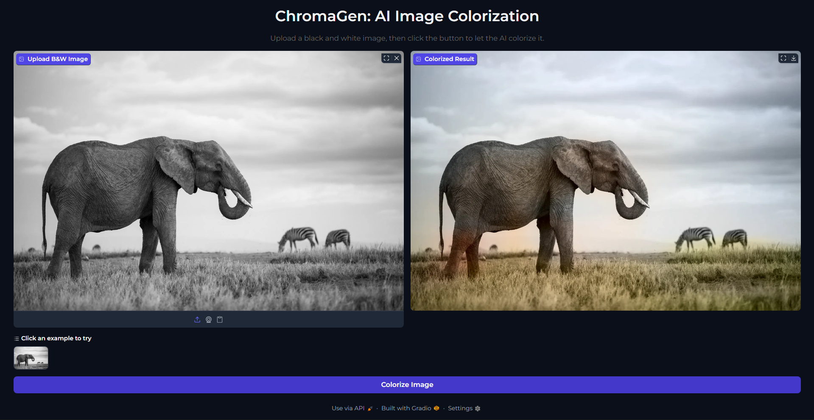

# ChromaGen: AI Image Colorization Web App

A user-friendly web application that uses a deep learning model to colorize black and white images. This project is built with Python, using TensorFlow for the model and Gradio for the web interface.

## How It Works

The application uses a sophisticated process to colorize images while preserving the original detail:

- **CIELAB Color Space:** The application converts the input image from RGB to the CIELAB color space. This separates the image into a Luminance channel ('L') which holds the black and white detail, and two color channels ('a' and 'b').
- **CNN Model:** A pre-trained Convolutional Neural Network (CNN), inspired by the architecture from the "Colorful Image Colorization" paper by Zhang et al., predicts the 'a' and 'b' color channels. The model runs on a down-scaled version of the image (128x128) for efficiency.
- **High-Clarity Reconstruction:** To ensure the final image is clear, the model's color output is up-scaled to the original image's resolution and combined with the original, high-resolution Luminance ('L') channel. This process ensures that the original image's sharpness and detail are preserved.

## Tech Stack

- **Language:** Python 3.9 or Pyhton 3.9+
- **Frameworks:** TensorFlow (Keras), Gradio
- **Libraries:** NumPy, Scikit-image

---

## Setup and Installation

### 1. Create a Virtual Environment

It is highly recommended to use a virtual environment to manage project dependencies.

**On Windows:**

```bash
python -m venv venv
.\venv\Scripts\activate
```

**On macOS/Linux:**

```bash
python3 -m venv venv
source venv/bin/activate
```

### 2. Install Dependencies

With your virtual environment activated, install all the required libraries using the `requirements.txt` file.

```bash
pip install -r requirements.txt
```

---

## How to Run the Application

Once the setup is complete, you can run the web application with a single command:

```bash
python app.py
```

This will start a local web server. Open the URL provided in your terminal (usually `http://127.0.0.1:7860`) in your web browser to use the ChromaGen app.

## Screenshot of the Application


